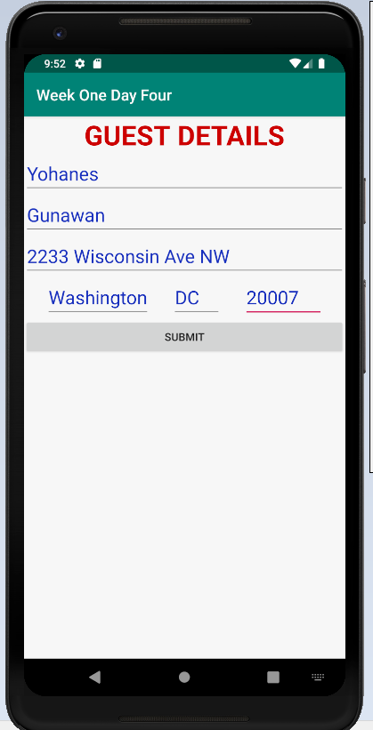
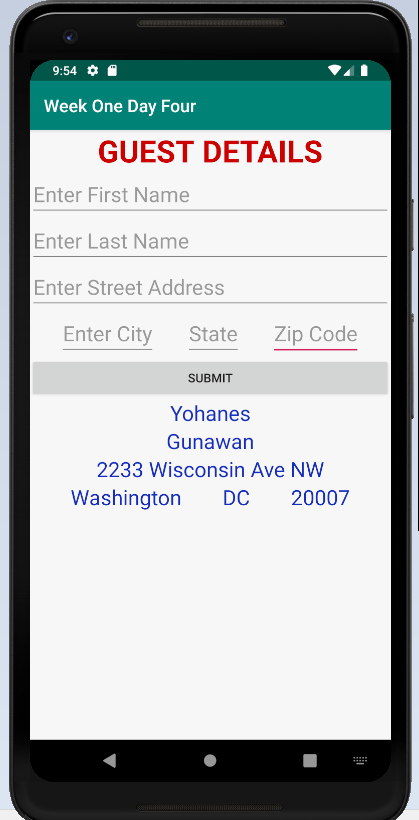

# Week1Daily4

Homework Part 1: Research word file is uploaded into the repository's root as: Week1Daily4 - Research.docx.

Homework Part 2: Coding

Create an activity with an edittext for each item listed below. On a button click, have the values from the edit text save to an Person Object. populate text views for each of the items below from the person object. (You have to make the person class). First Name, Last Name, Street Address, City, State, Zip

Instructions: 
- Run the Android project
- Create a new Virtual Device if not already. Then, choose Pixel 2 XL, then click OK.
- Edit texts will be displayed in the Emulator asking the user to input firstName, lastName, streetAddress, city, state and zip code. 
- After completing the form, please click the Submit button.
- It will then display the output on to the TextViews area right below the Submit button.

